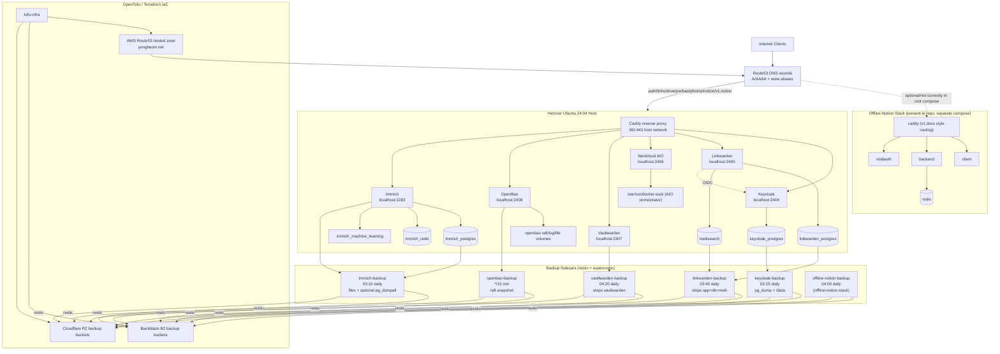

# Architecture Diagram

[![](https://mermaid.ink/img/pako:eNp9VmtvskgU_isTkjex21a8VvTDJqJ9t6RWG7WaXXzTjDAqERgyA1p7-e97BgZErPVDy5zznPtl5kOxqE2UjrLwVy7dWxvMQjTVFz5Cv36h2-yHDH_FMHpmdOdwh_qOv85xBZxHyzXDwQYZ3Z45Cog_pasIqWhKGMMryjxk4N4fgURoOvr9YobAv3WEWkkdN-tmdz5BYxqFpFlHG8pDYqN36pPFwj9Qf70k1Cv7JJQCek2PrC0Jualja7t08TsBGlrCIQrQMuGlyjNsz6WRvXIxI0A8Bx89hAD_Fk4VKJnVIjJPJ76dqDrNYn84Qdfo3l6TQvYMPyQMIjPTD9RzHeJL90HMTLMiVDBiUWZzyEpX7cIPdO73e4RdB3OSBpFpEs6BlKBBNMej1CwInzgKN6rr-Fuu2szZETXYq0tM1WBDQ8pVn4ZQdHVXLSdfn-gBipOoyAovSOYDCd99wtDLMvLDCNUa5Uoj5sg69LBtH8z4L4SxI4wTFDD6doBgOlpF7TQaSeURuL6nbJuV5LFnPpKD5VK8BaxLLewKXKfWqDSk8sHcHEAMe8xs4hdBTQka9swheQst0Qaoa4yKuDuJm83NGY7c8HttLYka6XGz65gWEZpEGE-m4XmOtTkF1LR6FlqSDlGYx16RMpgXKcMzzOwMM9KLFOMptQYtuZWJRE7cJNjlaY6lF8__mKUU9BqAw2tG-NWfnAo3S3RRyWAuHRdKjrATNTnc070xMMySRxzX4QQza5MHlNHI6PdQWeYmM-_EKS2aNp5krMJ0Ajkzm2HGGYQR2ynynwam5HrY2jg-eXXBObH48lmgUHuYk6IfI11WYdz9PTUXSgqDTRiqLl2rK8claEfdyCN8oeQ1-llvFnQOe7L6_VHv8X4MWtUdZiqLfNWmsHhYmcM_VIKWRhSySHjIcEjZVaz_4krS4wXIL21zyQZryReaODaxMOOoBDkNHQt2D48CwiwGt4KVGhOtpJtpB90mWxYGoFLv1JrIxo4rBj5Yv9qRF4AK1cYhzsqum8e2OZFtVDJZHlLwGgfBtb28jpsny-IMFOyOo5vT0OjUihpywGykdVMW7Cj6l1ptIs8Re0AUEXEfBxyWY9Y0umyXE3-rR2ui4hwipYFYoNhFMnjsuqndoS5aZbWC4MltsmhR3vfKUVupAOMh4M4qLeZYDnS8D8RIytmMz_Ho5Qmzudwn8Snr4viUzY08SVXxOTEWwz-Ttvg8vSeLzJPLEoxfliwyTyRnP0nOfpKEoC5LFpknkhDwZckiMyd5PnoTEmAYUYJGspjDpJgTUUwYf7ggA3ppMEdDaJZvBUsBWIe3Q6rhBvHUkEU9WIfkOKUjuA2t-KWREbrPhim6DrroSHuZPpg76tjinZBRx_d9Y2KWTrYnKOz2-_-Cb1Z89ZTgzQDriUOHHmDlMXjFwAq9yu08KZG0Wnq3nRLBpW_J4FXOa0mNvToZg_iRU84mT7xmkBUxBlG7hzhLVFCS3MRXjbQT98Lwp0YZXii3cqOsmWMrnZBF5EbxCPOwOCofQmyhhBvikYXSgU-brMQKWsAT_AvEAuz_R6mXSkLC1pv0EAWwJknfwdACRwTESViPwntL6dS0RqxC6Xwob0pH08r1Wl1raa1Wu11pN7Ub5QCgulZu37VbzbtGo92uVtv1rxvlPTZaLd_VNK1Sq7XbwGpWq62v_wEsAdha?type=png)](https://mermaid.live/edit#pako:eNp9VmtvskgU_isTkjex21a8VvTDJqJ9t6RWG7WaXXzTjDAqERgyA1p7-e97BgZErPVDy5zznPtl5kOxqE2UjrLwVy7dWxvMQjTVFz5Cv36h2-yHDH_FMHpmdOdwh_qOv85xBZxHyzXDwQYZ3Z45Cog_pasIqWhKGMMryjxk4N4fgURoOvr9YobAv3WEWkkdN-tmdz5BYxqFpFlHG8pDYqN36pPFwj9Qf70k1Cv7JJQCek2PrC0Jualja7t08TsBGlrCIQrQMuGlyjNsz6WRvXIxI0A8Bx89hAD_Fk4VKJnVIjJPJ76dqDrNYn84Qdfo3l6TQvYMPyQMIjPTD9RzHeJL90HMTLMiVDBiUWZzyEpX7cIPdO73e4RdB3OSBpFpEs6BlKBBNMej1CwInzgKN6rr-Fuu2szZETXYq0tM1WBDQ8pVn4ZQdHVXLSdfn-gBipOoyAovSOYDCd99wtDLMvLDCNUa5Uoj5sg69LBtH8z4L4SxI4wTFDD6doBgOlpF7TQaSeURuL6nbJuV5LFnPpKD5VK8BaxLLewKXKfWqDSk8sHcHEAMe8xs4hdBTQka9swheQst0Qaoa4yKuDuJm83NGY7c8HttLYka6XGz65gWEZpEGE-m4XmOtTkF1LR6FlqSDlGYx16RMpgXKcMzzOwMM9KLFOMptQYtuZWJRE7cJNjlaY6lF8__mKUU9BqAw2tG-NWfnAo3S3RRyWAuHRdKjrATNTnc070xMMySRxzX4QQza5MHlNHI6PdQWeYmM-_EKS2aNp5krMJ0Ajkzm2HGGYQR2ynynwam5HrY2jg-eXXBObH48lmgUHuYk6IfI11WYdz9PTUXSgqDTRiqLl2rK8claEfdyCN8oeQ1-llvFnQOe7L6_VHv8X4MWtUdZiqLfNWmsHhYmcM_VIKWRhSySHjIcEjZVaz_4krS4wXIL21zyQZryReaODaxMOOoBDkNHQt2D48CwiwGt4KVGhOtpJtpB90mWxYGoFLv1JrIxo4rBj5Yv9qRF4AK1cYhzsqum8e2OZFtVDJZHlLwGgfBtb28jpsny-IMFOyOo5vT0OjUihpywGykdVMW7Cj6l1ptIs8Re0AUEXEfBxyWY9Y0umyXE3-rR2ui4hwipYFYoNhFMnjsuqndoS5aZbWC4MltsmhR3vfKUVupAOMh4M4qLeZYDnS8D8RIytmMz_Ho5Qmzudwn8Snr4viUzY08SVXxOTEWwz-Ttvg8vSeLzJPLEoxfliwyTyRnP0nOfpKEoC5LFpknkhDwZckiMyd5PnoTEmAYUYJGspjDpJgTUUwYf7ggA3ppMEdDaJZvBUsBWIe3Q6rhBvHUkEU9WIfkOKUjuA2t-KWREbrPhim6DrroSHuZPpg76tjinZBRx_d9Y2KWTrYnKOz2-_-Cb1Z89ZTgzQDriUOHHmDlMXjFwAq9yu08KZG0Wnq3nRLBpW_J4FXOa0mNvToZg_iRU84mT7xmkBUxBlG7hzhLVFCS3MRXjbQT98Lwp0YZXii3cqOsmWMrnZBF5EbxCPOwOCofQmyhhBvikYXSgU-brMQKWsAT_AvEAuz_R6mXSkLC1pv0EAWwJknfwdACRwTESViPwntL6dS0RqxC6Xwob0pH08r1Wl1raa1Wu11pN7Ub5QCgulZu37VbzbtGo92uVtv1rxvlPTZaLd_VNK1Sq7XbwGpWq62v_wEsAdha)

## Sources Used

- `yongbeom-hetzner-auction-ubuntu-2404/tofu-infra/main.tf`
- `yongbeom-hetzner-auction-ubuntu-2404/tofu-infra/aws-dns-record/dns.tf`
- `yongbeom-hetzner-auction-ubuntu-2404/tofu-infra/backup_bucket/main.tf`
- `yongbeom-hetzner-auction-ubuntu-2404/caddy/Caddyfile`
- `yongbeom-hetzner-auction-ubuntu-2404/docker-compose.yaml`
- `yongbeom-hetzner-auction-ubuntu-2404/{keycloak,linkwarden,nextcloud,vaultwarden,openbao,immich}/docker-compose.yaml`
- `yongbeom-hetzner-auction-ubuntu-2404/BACKUPS.md`
- `yongbeom-hetzner-auction-ubuntu-2404/*/backup/crontab`
- `yongbeom-hetzner-auction-ubuntu-2404/offline-notion/docker-compose.yml`
